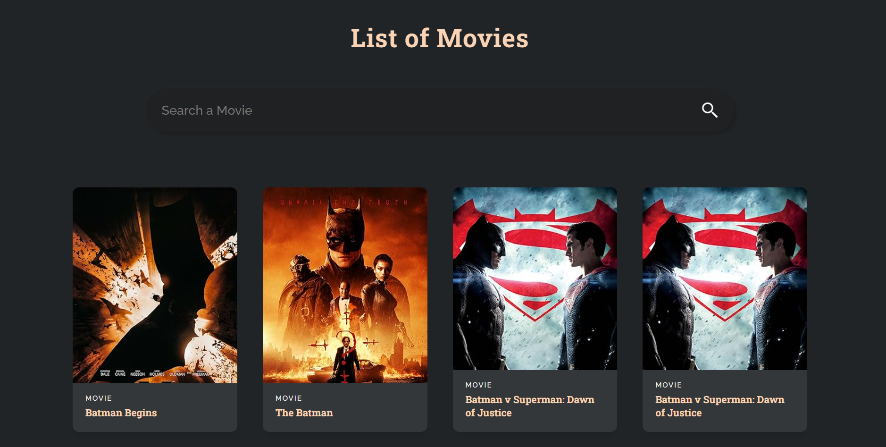

# Movie Search App

A simple app that uses the OMDB API to retrieve list of movies and created in react.

## Features
- A search bar to type in the requested movie
- Displays movie poster and title through the API

## Live Demo

## Screenshot

## Tech Stack
- OMDB API
- React
- Vite
- CSS
- HTML

## How to run locally
1. Clone repo
2. run 'npm install'
3. run 'npm run dev'